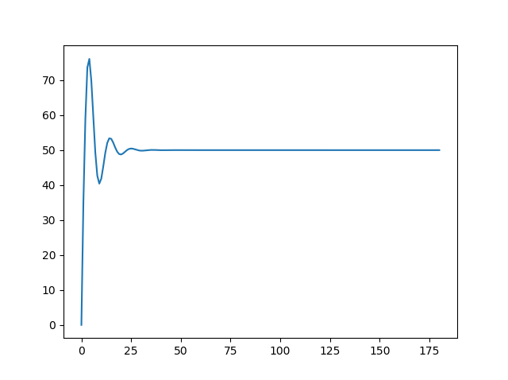
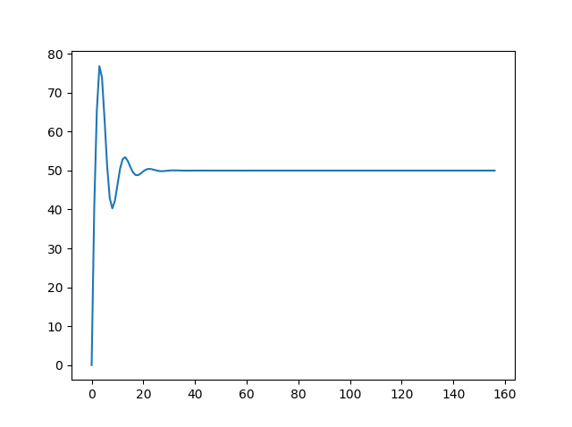
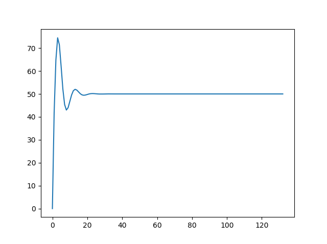

# DDPG_RL_PID
DDPG algorithm for PID tuning

 Custom PID Gym Environment  
  * To initialize  
     * Go to the folder that contains these files on cmd,  
     * pip install -e .  

 DDPG tunes the PID parameters every step  
 PID will give a reward at the end of everystep based on whether it has reached the setpoint or not  

After 10 episodes of training  
  

After 20 episodes of training  
  

After 30 episodes of training  
  

After 40 episodes of training  
  

After 50 episodes of training  
  
